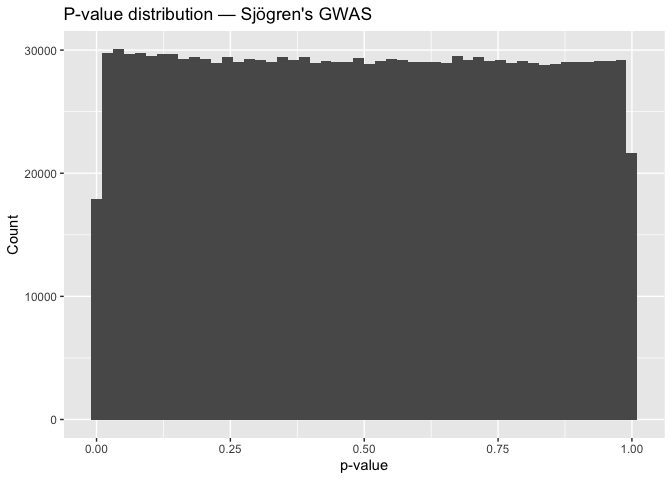
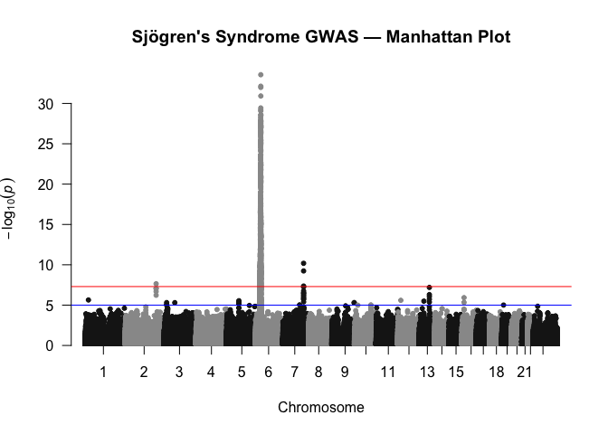
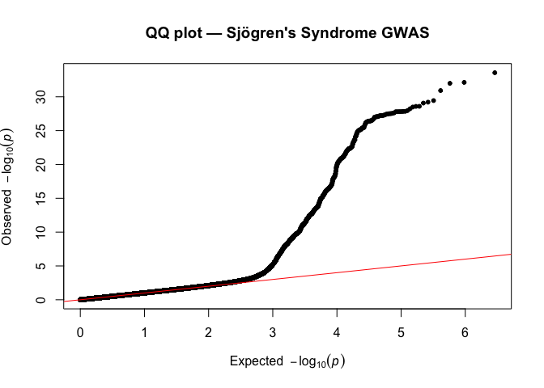

03 — GWAS Visualization: Manhattan & QQ Plots (Sjögren’s)
================
Sam Virolainen
2025-11-26

## Load Cleaned GWAS Data

``` r
gwas <- readRDS("../data/processed/harmonized/gwas_sjogrens_clean.rds")
glimpse(gwas)
```

    ## Rows: 1,442,662
    ## Columns: 11
    ## $ chromosome         <int> 1, 1, 1, 1, 1, 1, 1, 1, 1, 1, 1, 1, 1, 1, 1, 1, 1, …
    ## $ base_pair_location <int> 752566, 752721, 754063, 759036, 771967, 774047, 779…
    ## $ effect_allele      <chr> "C", "T", "T", "A", "A", "A", "G", "A", "G", "A", "…
    ## $ odds_ratio         <dbl> 0.9576, 0.9825, 1.0010, 0.9477, 0.9775, 1.1410, 0.9…
    ## $ standard_error     <dbl> 0.09064, 0.09870, 0.15770, 0.17140, 0.11330, 0.9184…
    ## $ ci_lower           <dbl> 0.8017, 0.8097, 0.7350, 0.6774, 0.7829, 0.1887, 0.8…
    ## $ ci_upper           <dbl> 1.144, 1.192, 1.364, 1.326, 1.221, 6.905, 1.170, 1.…
    ## $ p_value            <dbl> 0.6326, 0.8581, 0.9941, 0.7541, 0.8409, 0.8854, 0.7…
    ## $ beta               <dbl> -0.0433251247, -0.0176549352, 0.0009995003, -0.0537…
    ## $ other_allele       <chr> NA, NA, NA, NA, NA, NA, NA, NA, NA, NA, NA, NA, NA,…
    ## $ variant_id         <chr> "chr1:752566_C", "chr1:752721_T", "chr1:754063_T", …

## Prepare P-Values for Plotting

``` r
sum(gwas$p_value == 0, na.rm = TRUE)
```

    ## [1] 0

``` r
gwas <- gwas %>%
mutate(p_for_plot = ifelse(p_value == 0, 1e-300, p_value))
```

## Plot P-Value Histogram

``` r
ggplot(gwas, aes(x = p_value)) +
geom_histogram(bins = 50) +
labs(
title = "P-value distribution — Sjögren's GWAS",
x = "p-value",
y = "Count"
)
```

<!-- -->
\## Generate Manhattan Plot

``` r
manhattan(
gwas,
chr = "chromosome",
bp = "base_pair_location",
p = "p_for_plot",
snp = "variant_id",
genomewideline = -log10(5e-8),
suggestiveline = -log10(1e-5),
main = "Sjögren's Syndrome GWAS — Manhattan Plot"
)
```

<!-- -->
\## Generate Quantile Quantile Plot

``` r
qq(gwas$p_for_plot,
main = "QQ plot — Sjögren's Syndrome GWAS")
```

<!-- -->
\## Identify Top GWAS Hits

``` r
top_hits <- gwas %>%
arrange(p_value) %>%
slice(1:20) %>%
select(variant_id, chromosome, base_pair_location,
effect_allele, odds_ratio, beta, p_value)

top_hits
```

    ##          variant_id chromosome base_pair_location effect_allele odds_ratio
    ##              <char>      <int>              <int>        <char>      <num>
    ##  1: chr6:32590501_A          6           32590501             A      2.291
    ##  2: chr6:32678999_A          6           32678999             A      2.278
    ##  3: chr6:32681631_C          6           32681631             C      2.245
    ##  4: chr6:32623150_C          6           32623150             C      2.534
    ##  5: chr6:32628428_T          6           32628428             T      2.614
    ##  6: chr6:32418031_A          6           32418031             A      2.157
    ##  7: chr6:32424882_T          6           32424882             T      2.153
    ##  8: chr6:32670308_T          6           32670308             T      2.142
    ##  9: chr6:32670464_C          6           32670464             C      2.140
    ## 10: chr6:32605884_A          6           32605884             A      2.583
    ## 11: chr6:31704294_T          6           31704294             T      2.617
    ## 12: chr6:32059867_C          6           32059867             C      2.613
    ## 13: chr6:32660375_T          6           32660375             T      2.122
    ## 14: chr6:31620520_C          6           31620520             C      2.589
    ## 15: chr6:31918860_C          6           31918860             C      2.599
    ## 16: chr6:32080191_G          6           32080191             G      2.610
    ## 17: chr6:31636742_G          6           31636742             G      2.587
    ## 18: chr6:32664880_A          6           32664880             A      2.120
    ## 19: chr6:32666738_G          6           32666738             G      2.117
    ## 20: chr6:31725230_A          6           31725230             A      2.578
    ##          variant_id chromosome base_pair_location effect_allele odds_ratio
    ##          beta   p_value
    ##         <num>     <num>
    ##  1: 0.8289884 2.750e-34
    ##  2: 0.8232979 7.390e-33
    ##  3: 0.8087055 1.018e-32
    ##  4: 0.9297991 1.195e-31
    ##  5: 0.9608816 3.624e-30
    ##  6: 0.7687184 6.210e-30
    ##  7: 0.7668622 8.525e-30
    ##  8: 0.7617400 2.551e-29
    ##  9: 0.7608058 2.604e-29
    ## 10: 0.9489515 3.229e-29
    ## 11: 0.9620286 5.983e-29
    ## 12: 0.9604990 1.098e-28
    ## 13: 0.7523590 1.420e-28
    ## 14: 0.9512717 1.464e-28
    ## 15: 0.9551268 1.551e-28
    ## 16: 0.9593502 1.557e-28
    ## 17: 0.9504989 1.596e-28
    ## 18: 0.7514161 1.605e-28
    ## 19: 0.7500000 2.357e-28
    ## 20: 0.9470139 2.616e-28
    ##          beta   p_value

## Save Plots

``` r
if (!dir.exists("../results")) dir.create("../results")
```

## Save Manhattan Plot

``` r
png("../results/manhattan_sjogrens.png", width = 1200, height = 800)
manhattan(
gwas,
chr = "chromosome",
bp = "base_pair_location",
p = "p_for_plot",
snp = "variant_id",
genomewideline = -log10(5e-8),
suggestiveline = -log10(1e-5),
main = "Sjögren's Syndrome GWAS — Manhattan Plot"
)
dev.off()
```

    ## quartz_off_screen 
    ##                 2

## Save QQ plot

``` r
png("../results/qq_sjogrens.png", width = 800, height = 800)
qq(gwas$p_for_plot,
main = "QQ plot — Sjögren's Syndrome GWAS")
dev.off()
```

    ## quartz_off_screen 
    ##                 2
