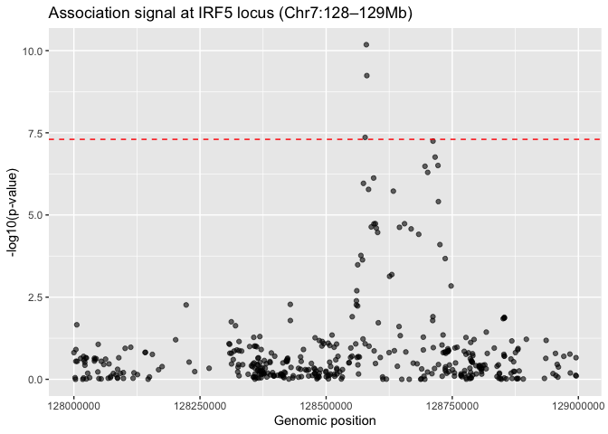

04_IRF5_Locus_Analysis
================
Sam Virolainen
2025-12-02

## Load Cleaned GWAS Dataset

``` r
gwas <- readRDS("../data/processed/harmonized/gwas_sjogrens_clean.rds")
```

## Define IRF5-TNPO3 Locus Region on Chromosome 7

``` r
chr = 7
locus_start = 128000000
locus_end   = 129000000
```

## Subset GWAS Results to Variants Overlapping IRF5-TNPO3 Locus

``` r
gwas_irf5 <- gwas %>%
filter(
chromosome == chr &
base_pair_location >= locus_start &
base_pair_location <= locus_end
)
```

## Confirm Number of SNPs at This Region

``` r
nrow(gwas_irf5)
```

    ## [1] 407

## Display SNPs at IRF5-TNPO3 Locus Ranked by Significance

``` r
gwas_irf5 %>%
arrange(p_value) %>%
select(
variant_id,
chromosome,
base_pair_location,
odds_ratio,
beta,
p_value
) %>%
slice(1:100)
```

    ##            variant_id chromosome base_pair_location odds_ratio       beta
    ##                <char>      <int>              <int>      <num>      <num>
    ##   1: chr7:128579666_A          7          128579666     1.5430  0.4337286
    ##   2: chr7:128580680_A          7          128580680     1.5020  0.4067976
    ##   3: chr7:128577304_A          7          128577304     0.6760 -0.3915622
    ##   4: chr7:128711874_T          7          128711874     1.6430  0.4965238
    ##   5: chr7:128716007_T          7          128716007     1.5780  0.4561582
    ##   6: chr7:128721724_T          7          128721724     1.5550  0.4414755
    ##   7: chr7:128695983_A          7          128695983     1.6150  0.4793350
    ##   8: chr7:128701331_C          7          128701331     1.6040  0.4725005
    ##   9: chr7:128594183_C          7          128594183     1.5930  0.4656190
    ##  10: chr7:128573967_A          7          128573967     1.3730  0.3169981
    ##  11: chr7:128584084_C          7          128584084     1.3690  0.3140805
    ##  12: chr7:128633244_A          7          128633244     1.5690  0.4504385
    ##  13: chr7:128722514_G          7          128722514     1.4150  0.3471295
    ##  14: chr7:128597587_T          7          128597587     0.7340 -0.3092463
    ##  15: chr7:128655434_A          7          128655434     0.7338 -0.3095188
    ##  16: chr7:128594725_G          7          128594725     0.7344 -0.3087014
    ##  17: chr7:128589427_G          7          128589427     0.7483 -0.2899513
    ##  18: chr7:128645370_T          7          128645370     0.7346 -0.3084291
    ##  19: chr7:128599397_C          7          128599397     0.7490 -0.2890163
    ##  20: chr7:128668510_T          7          128668510     0.7498 -0.2879488
    ##  21: chr7:128602142_A          7          128602142     0.7529 -0.2838229
    ##  22: chr7:128683547_T          7          128683547     0.7426 -0.2975977
    ##  23: chr7:128725550_G          7          128725550     1.3020  0.2639015
    ##  24: chr7:128568960_C          7          128568960     0.7614 -0.2725964
    ##  25: chr7:128736014_C          7          128736014     1.3670  0.3126186
    ##  26: chr7:128572040_A          7          128572040     0.7628 -0.2707594
    ##  27: chr7:128562578_T          7          128562578     0.7883 -0.2378766
    ##  28: chr7:128630227_C          7          128630227     0.7222 -0.3254532
    ##  29: chr7:128625788_G          7          128625788     0.7245 -0.3222735
    ##  30: chr7:128747708_C          7          128747708     1.3210  0.2783890
    ##  31: chr7:128560761_T          7          128560761     1.2400  0.2151114
    ##  32: chr7:128560035_A          7          128560035     1.2180  0.1972102
    ##  33: chr7:128428986_C          7          128428986     1.3380  0.2911760
    ##  34: chr7:128559928_C          7          128559928     1.2100  0.1906204
    ##  35: chr7:128222552_A          7          128222552     1.3440  0.2956502
    ##  36: chr7:128562446_G          7          128562446     0.8201 -0.1983290
    ##  37: chr7:128711699_C          7          128711699     0.8172 -0.2018714
    ##  38: chr7:128551740_G          7          128551740     1.1910  0.1747933
    ##  39: chr7:128853192_T          7          128853192     1.5530  0.4401885
    ##  40: chr7:128853303_G          7          128853303     1.5490  0.4376096
    ##  41: chr7:128853020_T          7          128853020     1.5480  0.4369638
    ##  42: chr7:128850875_C          7          128850875     1.5430  0.4337286
    ##  43: chr7:128429105_A          7          128429105     1.2280  0.2053868
    ##  44: chr7:128711228_A          7          128711228     0.8230 -0.1947991
    ##  45: chr7:128312022_T          7          128312022     1.1660  0.1535791
    ##  46: chr7:128603415_A          7          128603415     0.7984 -0.2251456
    ##  47: chr7:128005725_C          7          128005725     1.3010  0.2631332
    ##  48: chr7:128320374_T          7          128320374     1.1590  0.1475576
    ##  49: chr7:128644533_A          7          128644533     0.8068 -0.2146795
    ##  50: chr7:128817443_G          7          128817443     0.8355 -0.1797249
    ##  51: chr7:128731795_G          7          128731795     0.8595 -0.1514045
    ##  52: chr7:128511731_T          7          128511731     1.4260  0.3548733
    ##  53: chr7:128646939_T          7          128646939     0.7487 -0.2894169
    ##  54: chr7:128368628_A          7          128368628     1.2550  0.2271356
    ##  55: chr7:128692657_C          7          128692657     0.8567 -0.1546675
    ##  56: chr7:128356548_C          7          128356548     1.2050  0.1864796
    ##  57: chr7:128777177_A          7          128777177     1.2080  0.1889661
    ##  58: chr7:128478103_T          7          128478103     1.3660  0.3118868
    ##  59: chr7:128573128_T          7          128573128     0.8419 -0.1720940
    ##  60: chr7:128896885_A          7          128896885     1.4220  0.3520643
    ##  61: chr7:128793269_G          7          128793269     0.7778 -0.2512859
    ##  62: chr7:128201719_A          7          128201719     0.8544 -0.1573558
    ##  63: chr7:128936109_G          7          128936109     1.4130  0.3457151
    ##  64: chr7:128486446_T          7          128486446     1.3470  0.2978799
    ##  65: chr7:128868108_T          7          128868108     1.4080  0.3421703
    ##  66: chr7:128492397_T          7          128492397     1.3330  0.2874320
    ##  67: chr7:128327374_C          7          128327374     1.1920  0.1756326
    ##  68: chr7:128786618_C          7          128786618     0.8050 -0.2169130
    ##  69: chr7:128503942_T          7          128503942     1.1380  0.1292723
    ##  70: chr7:128495338_T          7          128495338     1.3100  0.2700271
    ##  71: chr7:128307573_T          7          128307573     1.1840  0.1688985
    ##  72: chr7:128577338_C          7          128577338     0.8316 -0.1844037
    ##  73: chr7:128558689_T          7          128558689     0.8955 -0.1103731
    ##  74: chr7:128520757_A          7          128520757     1.1730  0.1595646
    ##  75: chr7:128308813_C          7          128308813     1.1830  0.1680536
    ##  76: chr7:128048194_T          7          128048194     0.8890 -0.1176580
    ##  77: chr7:128729699_C          7          128729699     0.5770 -0.5499130
    ##  78: chr7:128507297_G          7          128507297     1.3090  0.2692635
    ##  79: chr7:128491603_C          7          128491603     1.2960  0.2592826
    ##  80: chr7:128360099_A          7          128360099     1.1170  0.1106465
    ##  81: chr7:128357813_G          7          128357813     1.1140  0.1079571
    ##  82: chr7:128585104_C          7          128585104     1.1140  0.1079571
    ##  83: chr7:128348405_A          7          128348405     1.1570  0.1458304
    ##  84: chr7:128362426_T          7          128362426     0.8797 -0.1281743
    ##  85: chr7:128515846_G          7          128515846     1.2150  0.1947441
    ##  86: chr7:128112709_C          7          128112709     1.1620  0.1501427
    ##  87: chr7:128759503_C          7          128759503     0.8815 -0.1261303
    ##  88: chr7:128712446_C          7          128712446     0.6030 -0.5058381
    ##  89: chr7:128755306_A          7          128755306     0.8829 -0.1245433
    ##  90: chr7:128548954_A          7          128548954     0.8684 -0.1411028
    ##  91: chr7:128833271_G          7          128833271     0.8361 -0.1790071
    ##  92: chr7:128101609_A          7          128101609     1.1190  0.1124354
    ##  93: chr7:128880489_G          7          128880489     0.9009 -0.1043610
    ##  94: chr7:128741379_T          7          128741379     0.7255 -0.3208942
    ##  95: chr7:128455079_A          7          128455079     1.3410  0.2934156
    ##  96: chr7:128371298_A          7          128371298     1.1700  0.1570037
    ##  97: chr7:128003956_C          7          128003956     1.1720  0.1587117
    ##  98: chr7:128879790_T          7          128879790     0.9035 -0.1014792
    ##  99: chr7:128692710_C          7          128692710     0.8847 -0.1225067
    ## 100: chr7:128323034_G          7          128323034     1.1130  0.1070591
    ##            variant_id chromosome base_pair_location odds_ratio       beta
    ##        p_value
    ##          <num>
    ##   1: 6.597e-11
    ##   2: 5.761e-10
    ##   3: 4.360e-08
    ##   4: 5.663e-08
    ##   5: 1.735e-07
    ##   6: 3.126e-07
    ##   7: 3.300e-07
    ##   8: 5.071e-07
    ##   9: 7.513e-07
    ##  10: 1.092e-06
    ##  11: 1.666e-06
    ##  12: 1.881e-06
    ##  13: 3.917e-06
    ##  14: 1.830e-05
    ##  15: 1.844e-05
    ##  16: 1.865e-05
    ##  17: 2.308e-05
    ##  18: 2.376e-05
    ##  19: 2.503e-05
    ##  20: 2.655e-05
    ##  21: 3.401e-05
    ##  22: 3.879e-05
    ##  23: 7.971e-05
    ##  24: 1.706e-04
    ##  25: 2.120e-04
    ##  26: 2.318e-04
    ##  27: 3.280e-04
    ##  28: 6.491e-04
    ##  29: 7.343e-04
    ##  30: 1.442e-03
    ##  31: 2.020e-03
    ##  32: 4.083e-03
    ##  33: 5.241e-03
    ##  34: 5.452e-03
    ##  35: 5.454e-03
    ##  36: 5.855e-03
    ##  37: 1.240e-02
    ##  38: 1.245e-02
    ##  39: 1.296e-02
    ##  40: 1.352e-02
    ##  41: 1.371e-02
    ##  42: 1.429e-02
    ##  43: 1.629e-02
    ##  44: 1.629e-02
    ##  45: 1.775e-02
    ##  46: 1.905e-02
    ##  47: 2.190e-02
    ##  48: 2.339e-02
    ##  49: 2.478e-02
    ##  50: 3.661e-02
    ##  51: 4.477e-02
    ##  52: 4.500e-02
    ##  53: 4.695e-02
    ##  54: 5.002e-02
    ##  55: 5.210e-02
    ##  56: 5.285e-02
    ##  57: 5.336e-02
    ##  58: 5.448e-02
    ##  59: 5.921e-02
    ##  60: 6.048e-02
    ##  61: 6.141e-02
    ##  62: 6.259e-02
    ##  63: 6.536e-02
    ##  64: 6.622e-02
    ##  65: 6.805e-02
    ##  66: 7.062e-02
    ##  67: 7.068e-02
    ##  68: 7.542e-02
    ##  69: 7.942e-02
    ##  70: 8.175e-02
    ##  71: 8.250e-02
    ##  72: 8.312e-02
    ##  73: 8.357e-02
    ##  74: 8.461e-02
    ##  75: 8.589e-02
    ##  76: 8.623e-02
    ##  77: 9.031e-02
    ##  78: 9.335e-02
    ##  79: 9.702e-02
    ##  80: 9.766e-02
    ##  81: 9.774e-02
    ##  82: 9.825e-02
    ##  83: 1.007e-01
    ##  84: 1.024e-01
    ##  85: 1.056e-01
    ##  86: 1.057e-01
    ##  87: 1.060e-01
    ##  88: 1.086e-01
    ##  89: 1.107e-01
    ##  90: 1.112e-01
    ##  91: 1.120e-01
    ##  92: 1.141e-01
    ##  93: 1.157e-01
    ##  94: 1.176e-01
    ##  95: 1.238e-01
    ##  96: 1.241e-01
    ##  97: 1.242e-01
    ##  98: 1.261e-01
    ##  99: 1.276e-01
    ## 100: 1.279e-01
    ##        p_value

## Plot P-values Across the IRF5-TNPO3 Locus

``` r
library(ggplot2)

ggplot(gwas_irf5, aes(x = base_pair_location, y = -log10(p_value))) +
geom_point(alpha = 0.6) +
geom_hline(yintercept = -log10(5e-8), color = "red", linetype = "dashed") +
labs(
title = "Association signal at IRF5 locus (Chr7:128–129Mb)",
x = "Genomic position",
y = "-log10(p-value)"
)
```

<!-- -->
\## Save Locus Table

``` r
saveRDS(
gwas_irf5,
"../data/processed/harmonized/gwas_sjogrens_IRF5_locus.rds"
)
```

## Save Table as CSV File for Downstream Analysis

``` r
fwrite(
gwas_irf5 %>% arrange(p_value),
"../data/processed/harmonized/gwas_sjogrens_IRF5_locus.csv"
)
```
